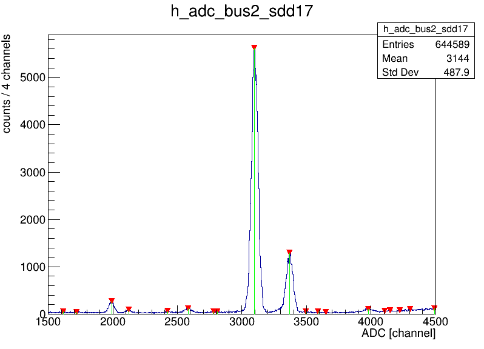

# Energy Calibration of SDDs

This repository contains the code used in the energy calibration of Silicon Drift Detectors (SDDs) in the <a href="https://iopscience.iop.org/article/10.1088/1402-4896/ac7fc0">SIDDHARTA-2 experiment</a> for high-precision X-ray spectroscopy measurements of kaonic atoms. 

The SDDs are placed around a cryogenic target cell made of high purity aluminum structure and 75 µm thick Kapton walls. 
The <a href="https://iopscience.iop.org/article/10.1088/1402-4896/ac95da">energy calibration</a> of the SDDs is performed using two X-ray tubes installed on two sides of the vacuum chamber and a multi-element target made of high purity titanium and copper strips placed on the target cell walls. The X-ray tubes induce the fluorescence emission of the target elements, and the characteristic Kα and Kβ transitions are detected by the SDDs. 

The energy response function of the detector is predominantly a Gaussian curve for every fluorescence X-ray peak. However, the response also has a low-energy component due to incomplete charge collection and electron-hole recombination. 
Thus, the total peak fit function is formed by two contributions: Gauss function (the main contribution to the peak shape) and tail function (an exponential function to reproduce the incomplete charge collection).

Only the Ti Kα and Cu Kα peaks are used to calibrate the detectors, as they have the highest signal-to-background ratio. 

This software package includes functionalities to find peaks on SDD spectra, conduct preliminary calibrations, and perform main fitting procedures using MINUIT. 

## Required software

A data analysis framework:

    ROOT 

Cross-platform build-system generator:

    CMake

## Necessary environment variables

Prior to using this software, a prerequisite is to perform an analysis of experimental data, following the guidelines provided in <a href="https://github.com/alex-nuclearboy/SpectrumAnalyser">Spectral Analyser</a>. 
Subsequently, it is essential to configure an environment variable XRAYSPECTRA. This variable specifies the precise location of the output data generated by the analysis, which comprises a collection of ROOT files containing spectral histograms.

For Unix-like operating systems, such as Linux, the XRAYSPECTRA environment variable can be set by adding the following line to the shell profile file (e.g., .bashrc):

    export XRAYSPECTRA=/path/to/rootfiles

Please ensure that you replace /path/to/rootfiles with the actual file path where your ROOT files are stored. 

## Installation & Compilation

To install and compile this software, follow these steps:

    git clone https://github.com/alex-nuclearboy/SDDCalibration.git
    cd SDDCalibration
    mkdir SDD-build
    cd SDD-build
    cmake ..
    make
    cd ..

## Usage

### Peak Finding

To automatically locate peaks within one selected spectrum, please execute the following command:

    ./peak_finder <ROOT file name> <bus number> <sdd number>

Replace \<ROOT file name> with the name of the analysed ROOT file, \<bus number> with the bus number, and \<SDD number> with the SDD number. 
This command will identify and list all the peaks detected in the spectrum.
The procedure will also display a histogram with the spectrum, highlighting the detected peaks (see the example below).

After identifying the peaks, create a text file with the same name as the input ROOT file and add the .txt extension. 
From the list of detected peaks, select the 12 most intense peaks. Organize and write them in this text file, adhering to the following order: 

    <bus> <sdd> <Ti Kα> <Cu Kα> <Ti Kβ> <Cu Kβ> <Remaining 8 peaks>

Sequentially execute this procedure for each SDD and write the positions of the identified peaks in each subsequent line of the file.

For example:

    1   1  2210  3378  2354  3662  4302  1546  1614  2818  1714  4106  1682  3894
    1   2  2150  3338  2290  3630  4286  2762  3858  3894  4498  1558  2586  2614
    1   4  2102  3262  2238  3546  4182  3802  4342  2710  2562  4466  3858  1838

    ...

    2  17  1990  3098  2122  3370  2582  3978  2426  3494  4490  3590  2810  1618

    ...

This structured data table will prove valuable for subsequent analysis.

### Preliminary Calibration

To perform a quick preliminary calibration of the spectra, please execute the following command:

    ./precalibration <ROOT file name> <peaks file name>

Replace \<ROOT file name> with the name of the ROOT file, and \<peaks file name> with the name of the file containing peak positions. 
This file should be the output of the peak finder procedure from the previous step and should correspond to the analysed ROOT file.

The prelimiary calibration will generate a table containing initial parameters required for the main calibration procedure.

### Main Fitting Procedure

To launch the main fitting procedure, please execute the following command:

    ./calibration <ROOT file name> <initial parameters file name>

Replace \<ROOT file name> with the name of the analysed ROOT file, and \<initial parameters file name> with the name of the correspondence file containing the initial parameters.

This command will begin the fitting procedure that uses MINUIT and is initiated by calling the MIGRAD function. 
The procedure involves fitting the spectra using a Gaussian and Tail function combination to precisely determine the peak positions. 
These positions, specifically for the Ti Kα and Cu Kα peaks, are then used to calculate the calibration parameters, namely gain and offset. 
The resulting parameters are stored in a .json file.
